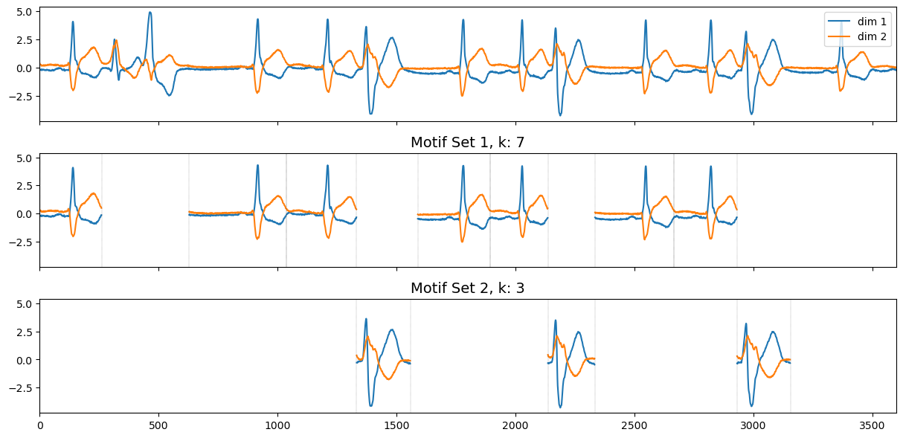

<h1 align="left">LoCoMotif: Discovering time-warped motifs in time series </h1>

This repository contains the implementation of the time series motif discovery (TSMD) method called LoCoMotif. LoCoMotif is a novel TSMD method that stands out from existing methods as it able to discover motifs that have different lengths (*variable-length* motifs), exhibit slight temporal differences (*time-warped* motifs), and span multiple dimensions (*multivariate* motifs). LoCoMotif was proposed in this [publication](https://link.springer.com/article/10.1007/s10618-024-01032-z).


## 🚂  Installation
The easiest way to install is to use pip.


### Install using pip

```
TODO
```

You can also install from source.

### Build from source
First, clone the repository:
```
git clone https://github.com/ML-KULeuven/locomotif.git
```
Then, navigate into the directory and build the package from source:
```
pip install .
```

## 🚂 Usage

A time series is representated as 2d numpy array of shape `(n, d)` where `n` is the length of the time series and `d` the number of dimensions:

```python
f = open(os.path.join("..", "examples", "datasets", "mitdb_patient214.csv"))
ts = np.array([line.split(',') for line in f.readlines()], dtype=np.double)

print(ts.shape)
>>> (3600, 2)
```

To apply LoCoMotif to the time series, simply import the `locomotif` module and call the ``apply_locomotif`` method with suitable parameter values. Note that, we highly advise you to first z-normalize the time series.
```python
import locomotif.locomotif as locomotif 
ts = (ts - np.mean(ts, axis=None)) / np.std(ts, axis=None)
motif_sets = locomotif.apply_locomotif(ts, l_min=216, l_max=360, rho=0.6)
```
The parameters `l_min` and `l_max` respectively represent the minimum and maximum motif length of the representative of a motif set. The parameter ``rho`` determines the ''strictness'' of the LoCoMotif method; or in other words, how similar the subsequences in a motif set are expected to be. The best value of ``rho`` depends heavily on the application; however, in most of our experiments, a value between ``0.6`` and ``0.8`` always works relatively well.  
Optionally, we allow you to choose how the allowed overlap between motifs through the `overlap` parameter (which lies between `0.0` and `0.5`), the number of motif sets to be discovered through the `nb` parameter (by default, `nb=None` and LoCoMotif finds all motifs), and whether to use time warping or not through the `warping` parameter (either `True` or `False`)

The result of LoCoMotif is a list of ``(candidate, motif_set)`` tuples, where each `candidate` is the representative subsequence (the most "central" subsequence) of the corresponding `motif_set`. Each `candidate` is a tuple of two integers `(b, e)` representing the start- and endpoint of the corresponding time segment, while each `motif_set` is a list of such tuples.

```python
print(motif_sets)
>>> [((2666, 2932), [(2666, 2932), (1892, 2137), (1038, 1333), (3168, 3490), (2334, 2666), (628, 1036), (1589, 1893), (1, 261)]), ((1333, 1565), [(1333, 1565), (2137, 2333), (2932, 3162)])]
```

We also include a visualization module, ``visualize``, to plot the time series together with the found motifs:
```python
import locomotif.visualize as visualize
import matplotlib.pyplot as plt

fig, ax = visualize.plot_motif_sets(ts, motif_sets)
plt.show()
```
<div align="center">
	
</div>

More examples can be found in [this folder](https://github.com/ML-KULeuven/locomotif/tree/main/examples).